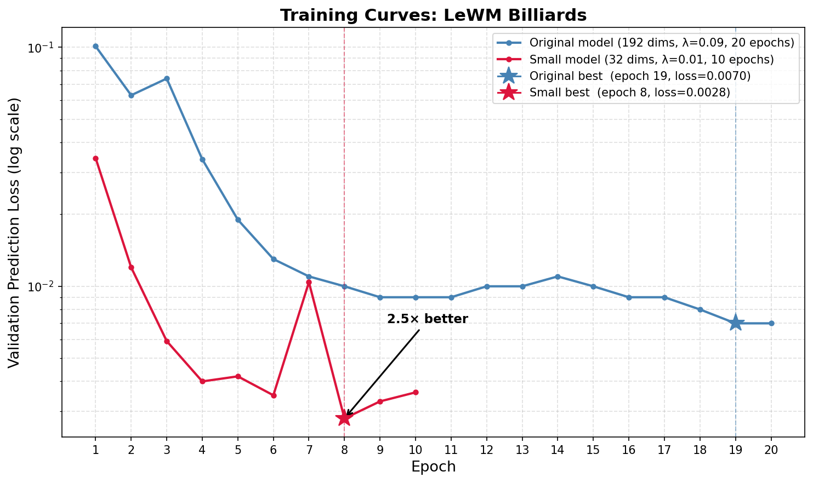
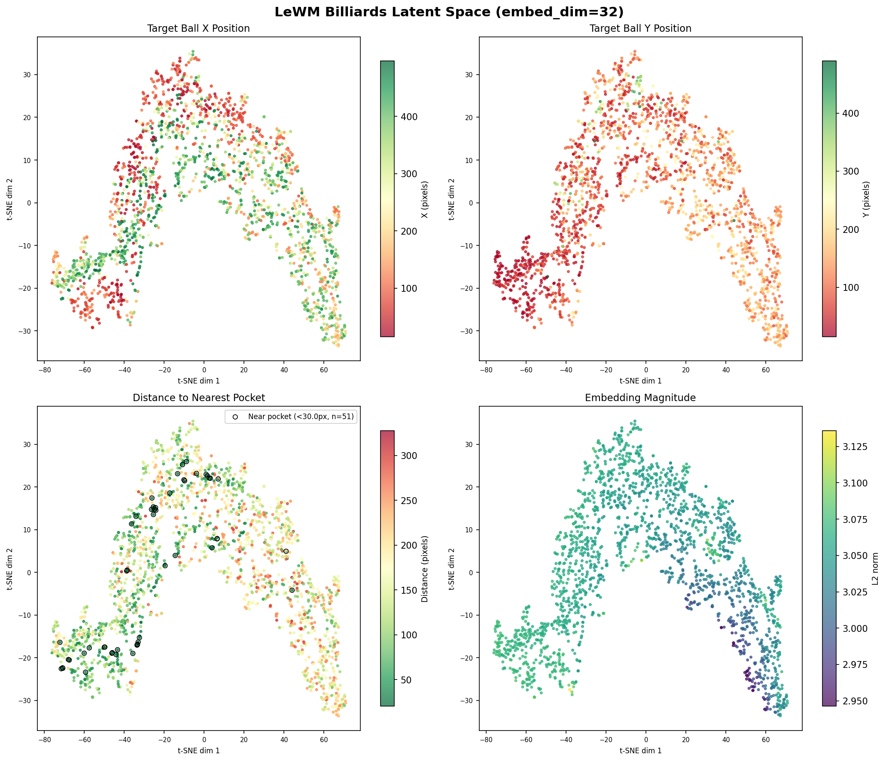
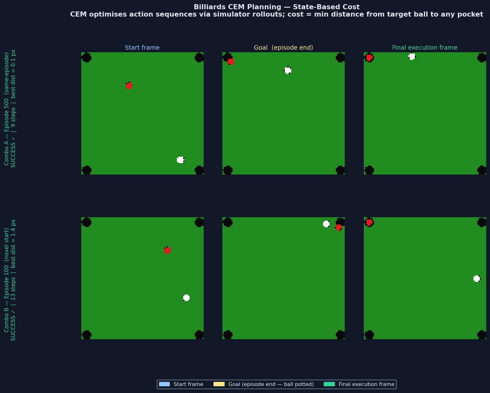

# 🎱 Billiards Domain Extension — by Santosh Jaiswal (hellojais)

This fork extends the original LeWM repository with
a complete research study applying world models to
a custom 2D billiards environment.

## What's new in this fork

| Addition | Description |
|---|---|
| `experiments/billiards/` | Six experiments: four planning + two architecture ablations |
| `config/train/billiards_small.yaml` | Optimised config (embed_dim=32, λ=0.01) for simple domains |
| `config/train/billiards_mamba.yaml` | Mamba predictor training config |
| `config/train/billiards_framestacking.yaml` | 9-channel frame-stacking training config |
| `config/train/data/billiards.yaml` | Billiards dataset config (96×96, flat HDF5) |
| `module_mamba.py` | Pure PyTorch S6 Mamba predictor (MPS-compatible) |
| `data_framestacking.py` | 9-channel frame-stacking dataset wrapper |
| `results/` | GIFs, t-SNE plots, training curves, probe results, 3-way comparison |
| `FINDINGS.md` | Complete research findings |
| `SETUP_NOTES.md` | Step-by-step setup for Apple Silicon M5 Max |
| MPS fixes in `train.py` | Apple Silicon compatibility |

## Key findings

- Pure JEPA embedding-based planning **failed** on billiards across all cost functions
- Root cause: velocity barely encoded (R²≈0.30) vs position (R²=0.983)
- **Ablation — Mamba predictor:** stateful architecture makes no difference (vel R²=0.297, +0.3%)
- **Ablation — Frame stacking (9-channel input):** target-ball velocity R² jumps to 0.77, but position R² collapses from 0.983 → 0.579
- **Core discovery — JEPA representational eviction:** with explicit motion signal available, the JEPA objective trades position encoding for velocity encoding. Confirmed by 1000-epoch extended probe — information is genuinely absent, not a probe artifact.
- Fundamental conflict: JEPA's single objective cannot simultaneously satisfy next-state predictability (training) and goal-relevant spatial completeness (planning)
- State-based CEM **succeeded** in 9–13 steps — the task is plannable; only the learned model is the obstacle
- Finding mirrors LeWM paper's Two-Room limitation — single prediction objective is insufficient for goal-directed planning

## Results

**Planning experiments (Combo A = same-episode, Combo B = cross-episode):**

| Approach | Combo A | Combo B | Notes |
|---|---|---|---|
| JEPA embedding CEM (192 dims) | ❌ FAIL | ❌ FAIL | Flat embedding landscape |
| JEPA embedding CEM (32 dims) | ❌ FAIL | ❌ FAIL | Better prediction, same issue |
| State-based CEM | ✅ SUCCESS | ✅ SUCCESS | 9 and 13 steps |
| Probe-based CEM | ❌ FAIL | ❌ FAIL | Position known, velocity unknown |

**Architecture ablations (representation quality, 300-epoch probe):**

| Model | vel R² | pos R² (tgt) | val/pred_loss | Finding |
|---|---|---|---|---|
| Transformer (baseline) | 0.296 | 0.983 | 0.0035 | reference |
| Mamba predictor | 0.297 | 0.983 | 0.0034 | architecture not the bottleneck |
| Frame stacking (9-channel) | 0.286 | 0.579 | 0.0087 | JEPA eviction: tgt vel ↑ 0.77, position ↓ 0.58 |





## Dataset and Model

- 📊 Dataset: [billiards-worldmodel on HuggingFace](https://huggingface.co/datasets/hellojais/billiards-worldmodel)
- 🤖 Model: [lewm-billiards on HuggingFace](https://huggingface.co/hellojais/lewm-billiards)
- 🎮 Game: [billiards-worldmodel on GitHub](https://github.com/hellojais/billiards-worldmodel)

## Credits

Original LeWM by:
Lucas Maes, Quentin Leroux, Gauthier Gidel, Glen Berseth
Mila / McGill University (2025)
[arXiv:2603.19312](https://arxiv.org/abs/2603.19312)
[Original repo](https://github.com/lucas-maes/le-wm)

---

(Original README below)

---

# LeWorldModel
### Stable End-to-End Joint-Embedding Predictive Architecture from Pixels

[Lucas Maes*](https://x.com/lucasmaes_), [Quentin Le Lidec*](https://quentinll.github.io/), [Damien Scieur](https://scholar.google.com/citations?user=hNscQzgAAAAJ&hl=fr), [Yann LeCun](https://yann.lecun.com/) and [Randall Balestriero](https://randallbalestriero.github.io/)

**Abstract:** Joint Embedding Predictive Architectures (JEPAs) offer a compelling framework for learning world models in compact latent spaces, yet existing methods remain fragile, relying on complex multi-term losses, exponential moving averages, pretrained encoders, or auxiliary supervision to avoid representation collapse. In this work, we introduce LeWorldModel (LeWM), the first JEPA that trains stably end-to-end from raw pixels using only two loss terms: a next-embedding prediction loss and a regularizer enforcing Gaussian-distributed latent embeddings. This reduces tunable loss hyperparameters from six to one compared to the only existing end-to-end alternative. With ~15M parameters trainable on a single GPU in a few hours, LeWM plans up to 48× faster than foundation-model-based world models while remaining competitive across diverse 2D and 3D control tasks. Beyond control, we show that LeWM's latent space encodes meaningful physical structure through probing of physical quantities. Surprise evaluation confirms that the model reliably detects physically implausible events.

<p align="center">
   <b>[ <a href="https://arxiv.org/pdf/2603.19312v1">Paper</a> | <a href="https://huggingface.co/collections/quentinll/lewm">Checkpoints &amp; Data</a> | <a href="https://le-wm.github.io/">Website</a> ]</b>
</p>

<br>

<p align="center">
  
</p>

If you find this code useful, please reference it in your paper:
```
@article{maes_lelidec2026lewm,
  title={LeWorldModel: Stable End-to-End Joint-Embedding Predictive Architecture from Pixels},
  author={Maes, Lucas and Le Lidec, Quentin and Scieur, Damien and LeCun, Yann and Balestriero, Randall},
  journal={arXiv preprint},
  year={2026}
}
```

## Using the code
This codebase builds on [stable-worldmodel](https://github.com/galilai-group/stable-worldmodel) for environment management, planning, and evaluation, and [stable-pretraining](https://github.com/galilai-group/stable-pretraining) for training. Together they reduce this repository to its core contribution: the model architecture and training objective.

**Installation:**
```bash
uv venv --python=3.10
source .venv/bin/activate
uv pip install stable-worldmodel[train,env]
```

## Data

Datasets use the HDF5 format for fast loading. Download the data from [HuggingFace](https://huggingface.co/collections/quentinll/lewm) and decompress with:

```bash
tar --zstd -xvf archive.tar.zst
```

Place the extracted `.h5` files under `$STABLEWM_HOME` (defaults to `~/.stable-wm/`). You can override this path:
```bash
export STABLEWM_HOME=/path/to/your/storage
```

Dataset names are specified without the `.h5` extension. For example, `config/train/data/pusht.yaml` references `pusht_expert_train`, which resolves to `$STABLEWM_HOME/pusht_expert_train.h5`.

## Training

`jepa.py` contains the PyTorch implementation of LeWM. Training is configured via [Hydra](https://hydra.cc/) config files under `config/train/`.

Before training, set your WandB `entity` and `project` in `config/train/lewm.yaml`:
```yaml
wandb:
  config:
    entity: your_entity
    project: your_project
```

To launch training:
```bash
python train.py data=pusht
```

Checkpoints are saved to `$STABLEWM_HOME` upon completion.

For baseline scripts, see the stable-worldmodel [scripts](https://github.com/galilai-group/stable-worldmodel/tree/main/scripts/train) folder.

## Planning

Evaluation configs live under `config/eval/`. Set the `policy` field to the checkpoint path **relative to `$STABLEWM_HOME`**, without the `_object.ckpt` suffix:

```bash
# ✓ correct
python eval.py --config-name=pusht.yaml policy=pusht/lewm

# ✗ incorrect
python eval.py --config-name=pusht.yaml policy=pusht/lewm_object.ckpt
```

## Pretrained Checkpoints

Pretrained LeWM checkpoints for each environment are mirrored on the Hugging Face
Hub (model repos), alongside the datasets (dataset repos) in the same collection:

- [`quentinll/lewm-pusht`](https://huggingface.co/quentinll/lewm-pusht)
- [`quentinll/lewm-cube`](https://huggingface.co/quentinll/lewm-cube)
- [`quentinll/lewm-tworooms`](https://huggingface.co/quentinll/lewm-tworooms)
- [`quentinll/lewm-reacher`](https://huggingface.co/quentinll/lewm-reacher)

The full baseline checkpoint suite (PLDM, LeJEPA, IVL, IQL, GCBC, DINO-WM, DINO-WM-noprop)
is available on [Google Drive](https://drive.google.com/drive/folders/1r31os0d4-rR0mdHc7OlY_e5nh3XT4r4e):

<div align="center">

| Method | two-room | pusht | cube | reacher |
|:---:|:---:|:---:|:---:|:---:|
| pldm | ✓ | ✓ | ✓ | ✓ |
| lejepa | ✓ | ✓ | ✓ | ✓ |
| ivl | ✓ | ✓ | ✓ | — |
| iql | ✓ | ✓ | ✓ | — |
| gcbc | ✓ | ✓ | ✓ | — |
| dinowm | ✓ | ✓ | — | — |
| dinowm_noprop | ✓ | ✓ | ✓ | ✓ |

</div>

## Loading a checkpoint

### From the Drive archive

Each tar archive contains two files per checkpoint:
- `<name>_object.ckpt` — a serialized Python object for convenient loading; this is what `eval.py` and the `stable_worldmodel` API use
- `<name>_weight.ckpt` — a weights-only checkpoint (`state_dict`) for cases where you want to load weights into your own model instance

Place the extracted files under `$STABLEWM_HOME/` and load via:

```python
import stable_worldmodel as swm

# Load the cost model (for MPC)
cost = swm.policy.AutoCostModel('pusht/lewm')
```

`AutoCostModel` accepts:
- `run_name` — checkpoint path **relative to `$STABLEWM_HOME`**, without the `_object.ckpt` suffix
- `cache_dir` — optional override for the checkpoint root (defaults to `$STABLEWM_HOME`)

The returned module is in `eval` mode with its PyTorch weights accessible via `.state_dict()`.

### From the Hugging Face mirror

The HF model repos ship the LeWM checkpoint as a `weights.pt` (state dict) plus a
`config.json` describing the model. Convert once to produce the `_object.ckpt`
that `eval.py` expects:

```bash
# download weights.pt + config.json
hf download quentinll/lewm-pusht --local-dir $STABLEWM_HOME/hf_pusht

# convert to object checkpoint under $STABLEWM_HOME/pusht/lewm_object.ckpt
python - <<'PY'
import json, torch, stable_pretraining as spt
from pathlib import Path
from jepa import JEPA
from module import ARPredictor, Embedder, MLP
import stable_worldmodel as swm

src = Path(swm.data.utils.get_cache_dir(), "hf_pusht")
out = Path(swm.data.utils.get_cache_dir(), "pusht", "lewm_object.ckpt")

cfg = json.loads((src / "config.json").read_text())
encoder = spt.backbone.utils.vit_hf(
    cfg["encoder"]["size"],
    patch_size=cfg["encoder"]["patch_size"],
    image_size=cfg["encoder"]["image_size"],
    pretrained=False, use_mask_token=False,
)
mlp = lambda k: MLP(input_dim=cfg[k]["input_dim"], output_dim=cfg[k]["output_dim"],
                    hidden_dim=cfg[k]["hidden_dim"], norm_fn=torch.nn.BatchNorm1d)
model = JEPA(
    encoder=encoder,
    predictor=ARPredictor(**cfg["predictor"]),
    action_encoder=Embedder(**cfg["action_encoder"]),
    projector=mlp("projector"),
    pred_proj=mlp("pred_proj"),
)
sd = torch.load(src / "weights.pt", map_location="cpu", weights_only=False)
model.load_state_dict(sd, strict=True)
out.parent.mkdir(parents=True, exist_ok=True)
torch.save(model, out)
PY
```

After conversion, load via `swm.policy.AutoCostModel('pusht/lewm')` as usual.

## Contact & Contributions
Feel free to open [issues](https://github.com/lucas-maes/le-wm/issues)! For questions or collaborations, please contact `lucas.maes@mila.quebec`
